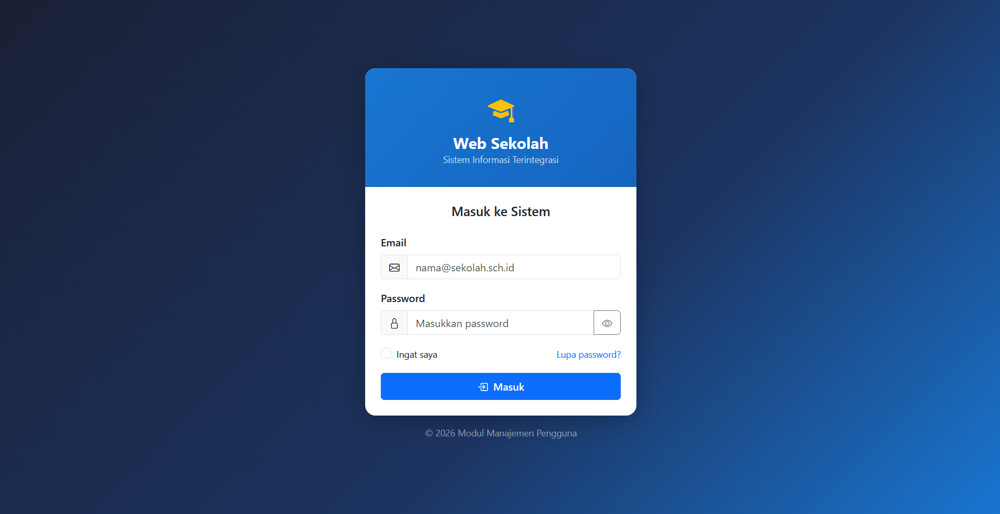
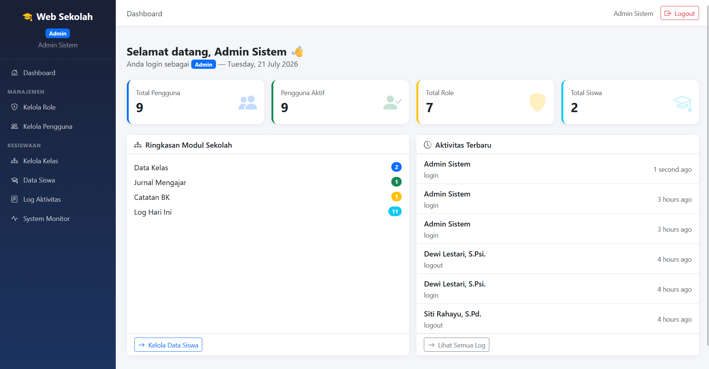
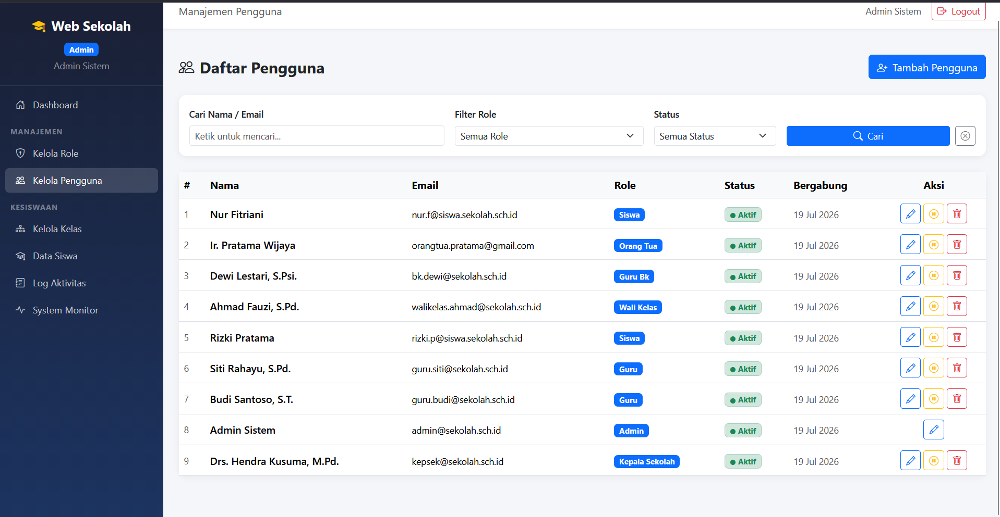
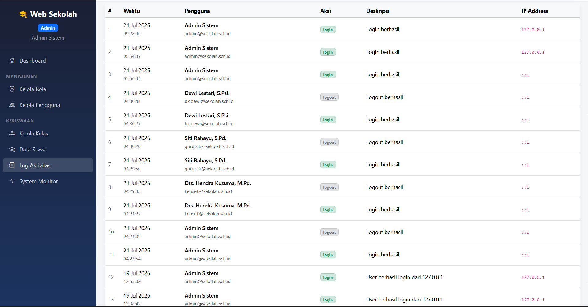
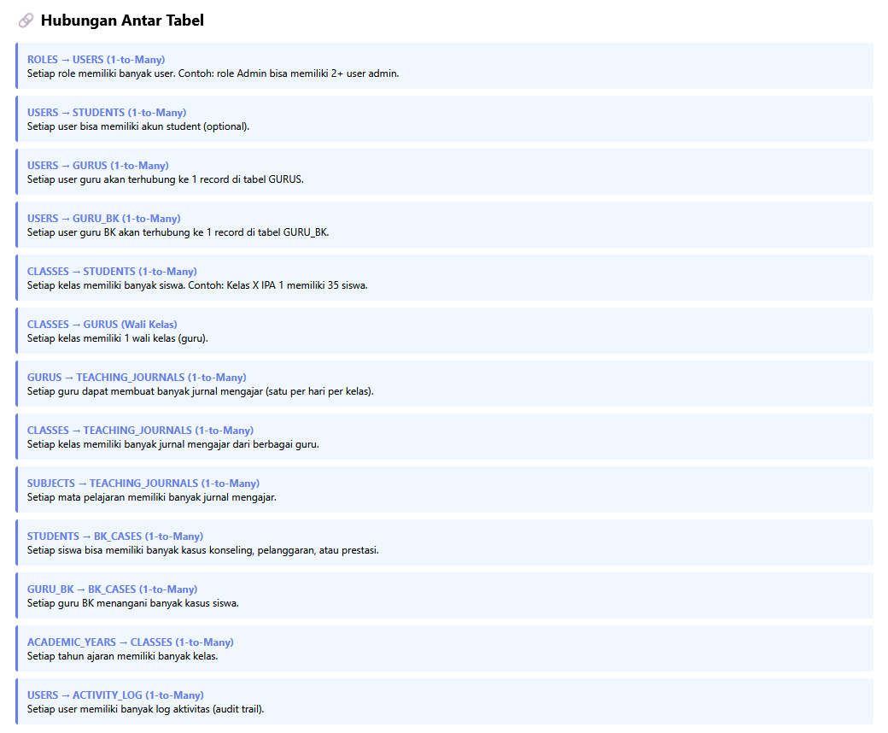
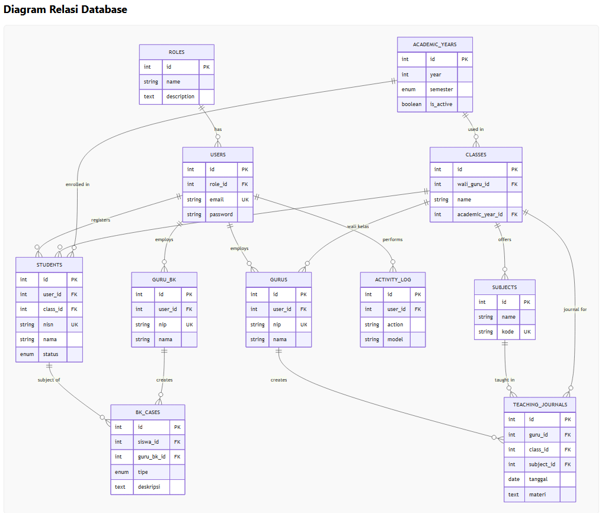

# Web Sekolah Terintegrasi - Modul Manajemen Pengguna

Repository ini berisi implementasi **Modul Manajemen Pengguna** untuk proyek MID mata kuliah Scalable System Design. Modul ini menjadi pusat autentikasi, otorisasi, audit log, dan integrasi API untuk modul lain seperti Jurnal Mengajar, BK, Kesiswaan, dan Akademik.

## Informasi Proyek

- **Judul Proyek**: Web Sekolah Terintegrasi Berbasis Scalable System Design
- **Fokus Repository**: Modul Manajemen Pengguna
- **Mata Kuliah**: Scalable System Design
- **Stack**: Laravel 13, PHP 8.3, MySQL 8, Bootstrap 5, Laravel Sanctum

## Link Presentasi

- **Video Presentasi (YouTube)**: [https://youtu.be/ExdHQ5Jqu8M](https://youtu.be/ExdHQ5Jqu8M)

## Deskripsi Sistem

Sistem sekolah dirancang modular agar mudah dikembangkan dan diskalakan. Repository ini mengelola:

- login dan logout
- reset password
- role-based access control (RBAC)
- manajemen akun pengguna
- manajemen role
- audit log aktivitas
- API verifikasi user untuk integrasi antar-modul

Dalam arsitektur sistem penuh, modul ini menjadi **sumber identitas utama** untuk seluruh ekosistem aplikasi sekolah.

## Nama Anggota Kelompok

- Ferdi Ardiansyah
- Anugrah
- Muh Arsy Alfarabi
- Anshori Ikhsan

## Pembagian Tugas

Pembagian tugas kelompok:

- **Ferdi Ardiansyah**: latar belakang, tujuan proyek, dan use case
- **Anugrah**: modul jurnal mengajar dan modul BK
- **Muh Arsy Alfarabi**: data kesiswaan, hak akses, dan database
- **Anshori Ikhsan**: arsitektur, pembagian vCPU, scaling, dan penutup

## Modul Dalam Sistem Sekolah

Sistem sekolah pada presentasi terdiri dari:

- **Modul Manajemen Pengguna**: autentikasi, otorisasi, akun, role, audit log, API verifikasi identitas
- **Modul Jurnal Mengajar**: input jurnal pembelajaran guru
- **Modul BK**: data konseling, pelanggaran, prestasi, dan tindak lanjut siswa
- **Modul Data Kesiswaan**: data inti siswa, kelas, dan status siswa
- **Modul Akademik**: nilai, jadwal, kelas, dan data pembelajaran

Repository ini hanya mengimplementasikan **Modul Manajemen Pengguna**, namun desain integrasinya disiapkan untuk modul lain.

## Fitur Yang Sudah Diimplementasikan

- Login dan logout berbasis session
- Reset password
- Redirect dashboard berdasarkan role
- Middleware RBAC berbasis role
- Helper cek role pada view
- Manajemen akun pengguna oleh admin
- Manajemen role oleh admin
- Search dan filter pengguna berdasarkan role/status
- Audit log aktivitas login, logout, dan perubahan data penting
- API integrasi antar-modul berbasis token Sanctum
- Data dummy untuk akun demo

## Role dan Hak Akses

Role default yang tersedia:

- admin
- kepala_sekolah
- guru
- guru_bk
- wali_kelas
- siswa
- orang_tua

Ringkasan akses:

- Admin dapat mengelola akun, role, dan melihat audit log
- Kepala sekolah dapat mengakses dashboard monitoring
- Guru diarahkan ke dashboard yang nantinya terhubung ke modul jurnal mengajar
- Guru BK diarahkan ke dashboard yang nantinya terhubung ke modul BK
- Wali kelas diarahkan ke dashboard yang nantinya terhubung ke data kelas/akademik
- Siswa dan orang tua hanya melihat menu relevan untuk perannya

## Rancangan Arsitektur Sistem

Pendekatan yang dipakai adalah **modular monolith dengan integrasi API internal**.

```text
[Client Browser / Mobile]
        |
        v
[Load Balancer / Reverse Proxy]
        |
        +-------------------+-------------------+-------------------+
        |                   |                   |                   |
        v                   v                   v                   v
[User Management]   [Jurnal Mengajar]      [BK]         [Data Kesiswaan/Akademik]
        |                   |                   |                   |
        +-------------------+-------------------+-------------------+
                            |
                            v
                  [Centralized MySQL Database]
```

Penjelasan singkat:

- Modul dipisah berdasarkan domain bisnis agar tidak saling bercampur
- Modul Manajemen Pengguna menyediakan login, verifikasi token, dan data role
- Database terpusat menjaga konsistensi data user, siswa, guru, dan aktivitas
- Modul dengan trafik tinggi dapat dipisah ke service atau node sendiri saat scale-out

## Pembagian vCPU / Server Virtual

Pembagian vCPU yang sesuai implementasi project saat ini:

1. vCPU 1-2: Aplikasi Laravel (web server + PHP runtime) untuk seluruh modul dalam satu codebase
2. vCPU 3: Database MySQL terpusat
3. vCPU 4: Reverse proxy, monitoring, logging, dan backup scheduler

Alasan teknis:

- Seluruh modul masih berjalan dalam satu aplikasi Laravel (modular monolith), jadi tidak dipisah per-modul ke VM terpisah
- Database dipisahkan agar beban I/O dan konsistensi data tetap terjaga
- Layer reverse proxy dan observability dipisahkan agar deployment, logging, dan backup lebih terkontrol
- Skema ini mudah di-scale: menambah vCPU aplikasi lebih dulu saat trafik meningkat

## Unsur Scalable System Design

1. Modular architecture: manajemen pengguna dipisah dari jurnal, BK, dan kesiswaan
2. Centralized database: tabel users, roles, dan activity_logs sebagai basis bersama
3. API-based integration: modul lain memverifikasi token dan role melalui endpoint API
4. Role-based access control: akses dibatasi sesuai role user
5. Logging dan audit trail: aktivitas sensitif dicatat ke activity_logs
6. Database optimization: foreign key dan struktur relasi dibuat jelas
7. Horizontal scaling: service login/API verifikasi dapat dipisah saat trafik meningkat
8. Vertical scaling: database server dapat ditambah CPU, RAM, atau storage
9. Caching: daftar role/menu dapat di-cache pada tahap optimasi berikutnya
10. Monitoring: audit log dan statistik aktivitas sebagai observabilitas awal

## Rancangan Database

Tabel utama modul manajemen pengguna:

- roles
- users
- activity_logs
- password_reset_tokens
- personal_access_tokens

Relasi utama:

- users.role_id -> roles.id
- activity_logs.user_id -> users.id
- personal_access_tokens.tokenable -> users

Dalam sistem sekolah penuh, tabel ini menjadi bagian dari database pusat bersama tabel domain lain seperti students, teachers, classes, subjects, schedules, dan teaching_journals.

## Struktur Folder Proyek

```text
app/
  Helpers/
  Http/
    Controllers/
      Admin/
      Api/
      Auth/
    Middleware/
    Requests/
  Models/
bootstrap/
config/
database/
  migrations/
  seeders/
public/
resources/views/
routes/
storage/
tests/
```

## Cara Instalasi

Prasyarat:

- Laragon atau PHP 8.3 + Composer + MySQL
- Git

Langkah instalasi lokal:

```bash
composer install
copy .env.example .env
php artisan key:generate
php artisan migrate --seed
```

Jika memakai Laragon seperti environment pengembangan saat ini:

```text
http://localhost/tugas-mid-scalable
```

## Cara Menjalankan Aplikasi

Opsi 1, melalui Laragon Apache:

```text
http://localhost/tugas-mid-scalable
```

Opsi 2, melalui server development Laravel:

```bash
php artisan serve
```

Lalu akses:

```text
http://127.0.0.1:8000
```

## Akun Demo

Password semua akun demo adalah **password123**.

- Admin Sistem: admin@sekolah.sch.id
- Kepala Sekolah: kepsek@sekolah.sch.id
- Guru 1: guru.siti@sekolah.sch.id
- Guru 2: guru.budi@sekolah.sch.id
- Guru BK: bk.dewi@sekolah.sch.id
- Wali Kelas: walikelas.ahmad@sekolah.sch.id
- Siswa 1: rizki.p@siswa.sekolah.sch.id
- Siswa 2: nur.f@siswa.sekolah.sch.id
- Orang Tua: orangtua.pratama@gmail.com

## API Integrasi Antar Modul

Endpoint utama:

- POST /api/auth/login
- POST /api/auth/logout
- GET /api/auth/verify
- GET /api/users
- GET /api/users/{id}/role

Contoh penggunaan:

- Modul Jurnal Mengajar memanggil /api/auth/verify untuk memastikan user ber-role guru
- Modul BK memanggil /api/auth/verify untuk memastikan user ber-role guru_bk
- Modul Akademik dapat memanggil /api/users?role=guru untuk lookup data guru
- Modul lain dapat menggunakan /api/users/{id}/role untuk validasi akses lanjutan

## Risiko Sistem dan Solusi

- Risiko kebocoran akses data sensitif: ditangani dengan RBAC dan middleware role
- Risiko penyalahgunaan akun: ditangani dengan password hashing, reset password, dan status aktif/nonaktif
- Risiko audit sulit ditelusuri: ditangani dengan activity_logs
- Risiko bottleneck login saat trafik naik: mitigasi dengan pemisahan service auth/API dan caching sesi/token
- Risiko inkonsistensi data antar-modul: mitigasi dengan database terpusat dan endpoint verifikasi yang sama

## Screenshot dan Diagram

Berikut dokumentasi visual yang sudah disertakan:

### Halaman Login



### Dashboard Admin



### Manajemen Pengguna



### Audit Log Aktivitas



### ERD Database



### Diagram Arsitektur Sistem



## Link Pengumpulan

- Link video presentasi YouTube: [https://youtu.be/ExdHQ5Jqu8M](https://youtu.be/ExdHQ5Jqu8M)
- Link repository GitHub: [https://github.com/nugrahn0123/MID-SSD-Web-Sekolah-Web-Manajemen-Pengguna](https://github.com/nugrahn0123/MID-SSD-Web-Sekolah-Web-Manajemen-Pengguna)
- Link dokumen laporan PDF: [https://drive.google.com/file/d/1H_EaOyWnxdu9F3UYOQ_gAJNA7d-Lo9IS/view?usp=sharing](https://drive.google.com/file/d/1H_EaOyWnxdu9F3UYOQ_gAJNA7d-Lo9IS/view?usp=sharing)

## Catatan Repository

- Jangan commit file .env berisi kredensial asli
- Gunakan data dummy saja
- Usahakan commit history menunjukkan kontribusi anggota
- Jika repository private, beri akses ke dosen
